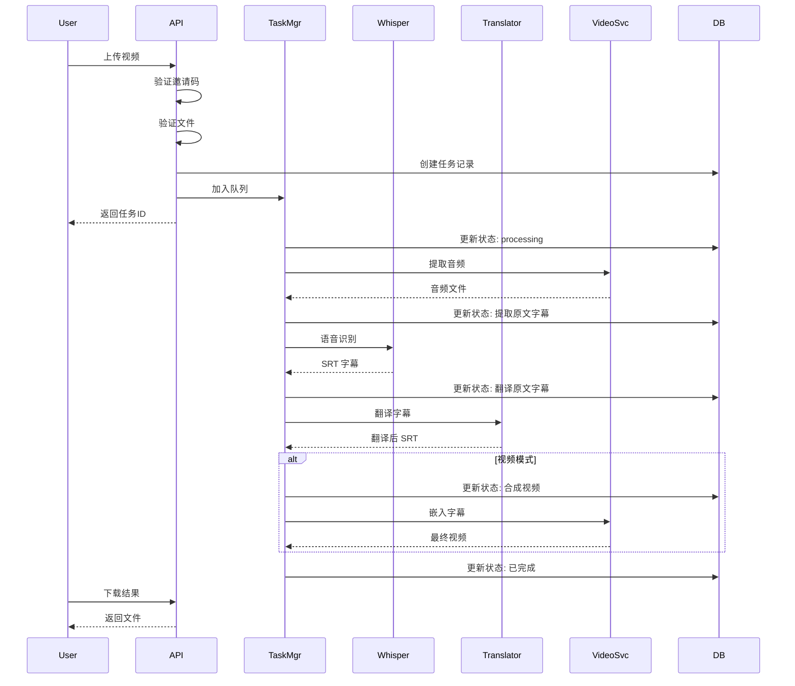
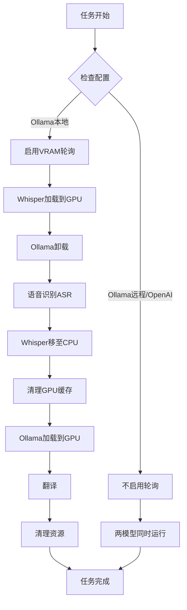

# 系统架构文档

本文档详细介绍 Tranvideo 的系统架构设计和核心技术实现。

## 目录

- [架构总览](#架构总览)
- [核心组件](#核心组件)
- [处理流程](#处理流程)
- [数据流](#数据流)
- [技术栈](#技术栈)
- [设计模式](#设计模式)

---

## 架构总览

### 系统架构图

```
┌─────────────────────────────────────────────────────────────┐
│                        用户层                                │
├────────────┬────────────────┬───────────────────────────────┤
│ Web 浏览器  │  HTTP 客户端    │  Python/JS SDK               │
└────────────┴────────────────┴───────────────────────────────┘
                              ↓
┌─────────────────────────────────────────────────────────────┐
│                      API 网关层                              │
├─────────────────────────────────────────────────────────────┤
│  Flask Router  │  安全模块  │  请求验证  │  速率限制        │
└─────────────────────────────────────────────────────────────┘
                              ↓
┌─────────────────────────────────────────────────────────────┐
│                     业务逻辑层                               │
├──────────────┬───────────────┬──────────────┬───────────────┤
│ 任务管理器    │  批次管理器    │  协调器       │ 进度跟踪器    │
└──────────────┴───────────────┴──────────────┴───────────────┘
                              ↓
┌─────────────────────────────────────────────────────────────┐
│                      服务层                                  │
├───────────────┬──────────────┬────────────────┬─────────────┤
│ Whisper 服务  │  翻译服务     │  视频处理服务   │ 文件服务    │
└───────────────┴──────────────┴────────────────┴─────────────┘
                              ↓
┌─────────────────────────────────────────────────────────────┐
│                    基础设施层                                │
├─────────────┬────────────────┬──────────────┬───────────────┤
│ VRAM 管理器  │  队列管理器     │  数据库      │  文件系统     │
└─────────────┴────────────────┴──────────────┴───────────────┘
                              ↓
┌─────────────────────────────────────────────────────────────┐
│                     外部依赖                                 │
├──────────────┬──────────────┬──────────────┬────────────────┤
│   Whisper    │    Ollama    │   FFmpeg     │   PyTorch      │
└──────────────┴──────────────┴──────────────┴────────────────┘
```

### 部署架构

```
┌──────────────────────────────────────────────────────────┐
│                    Docker Host                            │
├──────────────────────────────────────────────────────────┤
│                                                           │
│  ┌─────────────────┐         ┌────────────────────┐     │
│  │  Tranvideo      │◄────────┤  Ollama Container  │     │
│  │  Container      │         │  Port: 11434       │     │
│  │  Port: 5000     │         └────────────────────┘     │
│  └─────────────────┘                                     │
│         │                                                 │
│         │                                                 │
│         ▼                                                 │
│  ┌─────────────────────────────────────────────┐         │
│  │         Shared Volumes                      │         │
│  ├───────────────────┬─────────────────────────┤         │
│  │  cache/           │  db/        │  logs/    │         │
│  │  ├─ uploads/      │  └─tasks.json│          │         │
│  │  ├─ temp/         │              │          │         │
│  │  └─ outputs/      │              │          │         │
│  └─────────────────────────────────────────────┘         │
│                                                           │
│  ┌──────────────────────────────────────────┐            │
│  │         NVIDIA GPU (CUDA)                │            │
│  │  ┌────────────┐      ┌────────────┐      │            │
│  │  │  Whisper   │◄────►│   Ollama   │      │            │
│  │  │  Model     │ VRAM │   Model    │      │            │
│  │  └────────────┘ Swap └────────────┘      │            │
│  └──────────────────────────────────────────┘            │
└──────────────────────────────────────────────────────────┘
```

---

## 核心组件

### 1. API 层 (src/api/)

**职责**: 处理 HTTP 请求，路由分发

**主要文件**:
- `__init__.py` - 路由定义
- `handlers.py` - 请求处理器
- `security.py` - 安全管理器

**关键功能**:

```python
# 路由定义
@app.route('/api/process/srt/<invite_code>', methods=['POST'])
def process_srt(invite_code):
    # 1. 验证邀请码
    # 2. 验证文件
    # 3. 创建任务
    # 4. 返回任务ID
```

### 2. 核心业务层 (src/core/)

#### 任务管理器 (task.py)

**职责**: 单任务的完整生命周期管理

```python
class TaskProcessor:
    def process(self, task_id):
        # 1. 提取音频
        audio = self.extract_audio(video_path)

        # 2. 语音识别
        srt = self.transcribe(audio)

        # 3. 翻译
        translated_srt = self.translate(srt)

        # 4. 生成字幕文件
        self.generate_subtitles()

        # 5. 视频合成（可选）
        if mode == 'video':
            self.merge_video(srt)
```

#### 批次管理器 (batch.py)

**职责**: 批量任务的协调和管理

```python
class BatchManager:
    def create_batch(self, files, mode):
        # 1. 创建批次记录
        batch_id = generate_batch_id()

        # 2. 为每个文件创建子任务
        for file in files:
            task_id = create_task(file, batch_id, mode)
            tasks.append(task_id)

        # 3. 返回批次信息
        return batch_id, tasks
```

#### 任务协调器 (coordinate.py)

**职责**: 任务队列管理和调度

```python
class TaskCoordinator:
    def __init__(self):
        self.queue = Queue()
        self.current_task = None

    def add_task(self, task_id):
        self.queue.put(task_id)

    def process_queue(self):
        while True:
            task_id = self.queue.get()
            self.process_task(task_id)
```

### 3. 服务层 (src/services/)

#### Whisper 服务 (use_whisper.py)

**职责**: 语音识别服务封装

```python
class WhisperService:
    def __init__(self):
        self.model = whisper.load_model(
            "large-v3-turbo",
            device="cuda"
        )

    def transcribe(self, audio_path):
        result = self.model.transcribe(
            audio_path,
            language="auto",
            task="transcribe"
        )
        return result
```

#### 翻译服务 (tran.py)

**职责**: 多后端翻译服务

```python
class TranslationService:
    def translate(self, text, translator_type):
        if translator_type == "ollama":
            return self.ollama_translate(text)
        elif translator_type == "openai":
            return self.openai_translate(text)

    def ollama_translate(self, text):
        # Ollama API 调用
        pass

    def openai_translate(self, text):
        # OpenAI API 调用
        pass
```

#### 视频处理服务 (video.py)

**职责**: FFmpeg 视频处理封装

```python
class VideoService:
    def extract_audio(self, video_path):
        """提取音频"""
        cmd = [
            'ffmpeg', '-i', video_path,
            '-vn', '-acodec', 'pcm_s16le',
            '-ar', '16000', '-ac', '1',
            output_path
        ]
        subprocess.run(cmd)

    def merge_subtitles(self, video_path, srt_paths):
        """嵌入字幕"""
        cmd = [
            'ffmpeg', '-i', video_path,
            '-i', srt_paths[0],
            '-i', srt_paths[1],
            '-i', srt_paths[2],
            '-map', '0', '-map', '1', '-map', '2', '-map', '3',
            '-c', 'copy',
            output_path
        ]
        subprocess.run(cmd)
```

### 4. 工具层 (src/utils/)

#### VRAM 管理器 (vram_manager.py)

**职责**: GPU 显存智能调度

```python
class VRAMManager:
    def switch_to_translation_mode(self):
        """切换到翻译模式"""
        # 1. Whisper 移至 CPU
        self.whisper_model.to('cpu')

        # 2. 清理 GPU 缓存
        torch.cuda.empty_cache()
        gc.collect()

        # 3. 加载 Ollama 到 GPU
        self.load_ollama_to_gpu()

    def switch_to_transcription_mode(self):
        """切换到转录模式"""
        # 1. 卸载 Ollama
        self.unload_ollama()

        # 2. 清理 GPU 缓存
        torch.cuda.empty_cache()
        gc.collect()

        # 3. Whisper 移至 GPU
        self.whisper_model.to('cuda')
```

#### 进度跟踪器 (prog_bar/)

**职责**: 实时进度追踪

```python
class ProgressTracker:
    def update_progress(self, task_id, status, progress, prog_bar):
        """更新任务进度"""
        task = db.get_task(task_id)
        task['status'] = status
        task['progress'] = progress
        task['prog_bar'] = prog_bar
        task['updated_at'] = datetime.now()
        db.save_task(task)
```

---

## 处理流程

### 单任务处理流程



### VRAM 轮询流程



### 批量处理流程

```
1. 用户上传多个文件
   ↓
2. 创建批次记录
   ├─ batch_id
   ├─ total: 5
   └─ sub_tasks: [task1, task2, ...]
   ↓
3. 为每个文件创建子任务
   ├─ task1 → 队列
   ├─ task2 → 队列
   ├─ task3 → 队列
   ├─ task4 → 队列
   └─ task5 → 队列
   ↓
4. 按顺序处理
   ├─ processing: task1 (others waiting)
   ├─ completed: task1
   ├─ processing: task2
   ├─ completed: task2
   └─ ...
   ↓
5. 所有任务完成
   ↓
6. 打包结果为 ZIP
   ↓
7. 用户下载
```

---

## 数据流

### 文件流转

```
1. 上传阶段:
   用户文件 → cache/uploads/{task_id}.mp4

2. 处理阶段:
   cache/uploads/{task_id}.mp4
     ↓ (extract_audio)
   cache/temp/{task_id}/audio.wav
     ↓ (transcribe)
   cache/temp/{task_id}/{task_id}_raw.srt
     ↓ (translate)
   cache/temp/{task_id}/{task_id}_translated.srt
   cache/temp/{task_id}/{task_id}_bilingual.srt
     ↓ (merge_video, 可选)
   cache/temp/{task_id}/{task_id}_final.mp4

3. 输出阶段:
   cache/temp/{task_id}/*
     ↓ (copy)
   cache/outputs/{task_id}_*.srt
   cache/outputs/{task_id}_final.mp4

4. 下载后:
   cache/outputs/* → (24小时后删除)
```

### 数据库结构

```json
{
  "single_tasks": {
    "task_id_123": {
      "task_id": "task_id_123",
      "video_path": "cache/uploads/task_id_123.mp4",
      "video_name": "example.mp4",
      "video_duration": 1800.5,
      "mode": "srt",
      "status": "已完成",
      "progress": "完成",
      "current_step": "done",
      "prog_bar": 100,
      "batch_id": null,
      "invite_code": "kindmita",
      "created_at": "2025-10-23 10:30:00",
      "updated_at": "2025-10-23 10:45:00",
      "downloaded": false,
      "expired": false,
      "error": null,
      "resume_data": {
        "srt_generated": true,
        "translation_complete": true,
        "video_merged": false
      }
    }
  },
  "batch_tasks": {
    "batch_id_456": {
      "batch_id": "batch_id_456",
      "sub_tasks": {
        "task_1": {...},
        "task_2": {...}
      },
      "status": "已完成",
      "progress": "完成",
      "created_at": "2025-10-23 11:00:00",
      "updated_at": "2025-10-23 11:30:00"
    }
  }
}
```

---

## 技术栈

### 后端

| 技术 | 用途 | 版本 |
|------|------|------|
| Flask | Web 框架 | 2.0+ |
| PyTorch | 深度学习 | 2.0+ |
| Transformers | 模型加载 | 4.30+ |
| FFmpeg | 视频处理 | 4.0+ |
| Requests | HTTP 客户端 | 2.28+ |

### AI 模型

| 模型 | 用途 | 大小 |
|------|------|------|
| Whisper Large-V3-Turbo | 语音识别 | ~1.5GB |
| Qwen3:8B | 翻译 | ~4.5GB |

### 基础设施

| 组件 | 用途 | 说明 |
|------|------|------|
| Docker | 容器化 | 统一部署环境 |
| Ollama | LLM 推理 | 本地模型服务 |
| CUDA | GPU 加速 | 11.0+ |

---

## 设计模式

### 1. 单例模式 (Singleton)

```python
class WhisperService:
    _instance = None

    def __new__(cls):
        if cls._instance is None:
            cls._instance = super().__new__(cls)
            cls._instance.model = load_model()
        return cls._instance
```

**应用**: Whisper 模型加载，确保全局唯一实例

### 2. 工厂模式 (Factory)

```python
class TranslatorFactory:
    @staticmethod
    def create(translator_type):
        if translator_type == "ollama":
            return OllamaTranslator()
        elif translator_type == "openai":
            return OpenAITranslator()
        else:
            raise ValueError("Unknown translator")
```

**应用**: 翻译服务选择

### 3. 观察者模式 (Observer)

```python
class ProgressObserver:
    def __init__(self):
        self.listeners = []

    def attach(self, listener):
        self.listeners.append(listener)

    def notify(self, progress):
        for listener in self.listeners:
            listener.update(progress)
```

**应用**: 进度追踪和通知

### 4. 策略模式 (Strategy)

```python
class VRAMStrategy:
    def execute(self, config):
        if is_local_ollama(config):
            return VRAMPollingStrategy()
        else:
            return NoPollingStrategy()
```

**应用**: VRAM 管理策略选择

### 5. 责任链模式 (Chain of Responsibility)

```python
class SecurityChain:
    def __init__(self):
        self.handlers = [
            FileTypeVerification(),
            RateLimiting(),
            IPBanned(),
            InviteCodeValidation()
        ]

    def process(self, request):
        for handler in self.handlers:
            if not handler.handle(request):
                return False
        return True
```

**应用**: API 安全验证链

---

## 性能优化

### 1. 显存优化

- **VRAM 轮询**: 8GB 显存即可运行
- **模型量化**: 使用 turbo 版本减少显存
- **批处理控制**: 限制并发减少内存峰值

### 2. 并发优化

- **单任务队列**: 避免资源竞争
- **异步 I/O**: 文件操作使用异步
- **线程池**: 限制线程数量

### 3. 缓存策略

- **24 小时自动清理**: 避免磁盘占满
- **临时文件即时删除**: 处理完成立即清理
- **数据库轻量化**: 使用 JSON 而非重型数据库

---

## 扩展性设计

### 水平扩展

```yaml
# docker-compose-cluster.yaml
services:
  tranvideo-1:
    image: tranvideo:latest
    deploy:
      replicas: 3

  nginx:
    image: nginx
    depends_on:
      - tranvideo-1
```

### 插件系统

```python
class TranslatorPlugin:
    def translate(self, text):
        raise NotImplementedError

# 用户可实现自定义翻译器
class CustomTranslator(TranslatorPlugin):
    def translate(self, text):
        # 自定义实现
        pass
```

---

## 相关文档

- 📖 [代码结构](Code-Structure.md) - 详细代码组织
- 🔧 [API 文档](API-Reference.md) - API 接口设计
- 🎯 [显存管理](VRAM-Management.md) - VRAM 技术细节
- 💡 [故障排除](Troubleshooting.md) - 架构相关问题

---

**文档版本**: v1.0
**最后更新**: 2025-10-24
**维护者**: MitaHill

[返回 Wiki 首页](Home.md)
