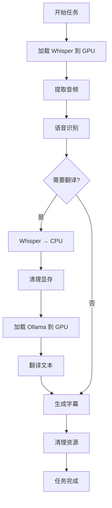

# 显存管理机制

Tranvideo 的核心特性之一是智能显存轮询管理,使得 **8GB 显存**的GPU即可流畅运行。

## 工作原理

### 传统方式的问题

在传统方案中,同时运行 Whisper 和 Ollama 模型需要:

- Whisper Large-V3-Turbo: ~4-5GB 显存
- Ollama (qwen3:8b): ~5-6GB 显存
- **总计**: ~10-11GB 显存

这意味着需要 **12GB+** 的显卡才能运行。

### Tranvideo 的解决方案

Tranvideo 采用 **显存轮询** (VRAM Polling) 机制:

```
阶段1: 语音识别
┌─────────────────────────────┐
│ GPU Memory (8GB)            │
├─────────────────────────────┤
│ ✅ Whisper: 4-5GB          │
│ ❌ Ollama: 卸载到CPU       │
│ 📊 剩余: 3-4GB             │
└─────────────────────────────┘

阶段2: 文本翻译
┌─────────────────────────────┐
│ GPU Memory (8GB)            │
├─────────────────────────────┤
│ ❌ Whisper: 移至CPU        │
│ ✅ Ollama: 5-6GB           │
│ 📊 剩余: 2-3GB             │
└─────────────────────────────┘
```

## 技术实现

### 显存轮询触发条件

显存轮询仅在以下条件下启用:

```json
{
  "translator_type": "ollama",
  "ollama_api": "http://127.0.0.1:11434"
}
```

> ⚠️ **重要**: 必须使用 `127.0.0.1`,使用 `localhost` 不会触发轮询!

### 代码实现

位置: `src/utils/vram_manager.py`

```python
class VRAMManager:
    def __init__(self):
        self.whisper_on_gpu = True
        self.ollama_loaded = False

    def switch_to_translation_mode(self):
        """切换到翻译模式: Whisper→CPU, Ollama→GPU"""
        # 1. 将 Whisper 模型移至 CPU
        move_whisper_to_cpu()

        # 2. 清理 GPU 缓存
        torch.cuda.empty_cache()

        # 3. 加载 Ollama 模型到 GPU
        load_ollama_model()

    def switch_to_transcription_mode(self):
        """切换到转录模式: Ollama→卸载, Whisper→GPU"""
        # 1. 卸载 Ollama 模型
        unload_ollama_model()

        # 2. 清理 GPU 缓存
        torch.cuda.empty_cache()

        # 3. 将 Whisper 加载到 GPU
        move_whisper_to_gpu()
```

### 处理流程



## 性能表现

### 显存占用

| 阶段 | Whisper | Ollama | 总占用 |
|------|---------|--------|--------|
| 待机 | - | - | ~500MB |
| 转录 | 4-5GB | CPU | ~5GB |
| 翻译 | CPU | 5-6GB | ~6GB |
| 峰值 | 切换时 | 切换时 | ~7GB |

### 处理速度

在 RTX 4070 Ti (8GB) 上的实测数据:

| 视频长度 | 转录时间 | 翻译时间 | 总时间 |
|---------|---------|---------|--------|
| 10分钟 | ~2分钟 | ~3分钟 | ~5分钟 |
| 30分钟 | ~5分钟 | ~10分钟 | ~15分钟 |
| 60分钟 | ~10分钟 | ~20分钟 | ~30分钟 |

> 翻译时间取决于视频中的语音密度

## 优化策略

### 1. 模型选择优化

```json
{
  "whisper_model": "large-v3-turbo",  // 更快更省显存
  "ollama_model": "qwen3:8b"          // 平衡性能和速度
}
```

**可选模型**:

| Whisper 模型 | 显存需求 | 速度 | 准确度 |
|-------------|---------|------|--------|
| large-v3-turbo | 4-5GB | ⚡⚡⚡ | ⭐⭐⭐ |
| large-v3 | 5-6GB | ⚡⚡ | ⭐⭐⭐⭐ |
| medium | 2-3GB | ⚡⚡⚡ | ⭐⭐ |

| Ollama 模型 | 显存需求 | 速度 | 质量 |
|------------|---------|------|------|
| qwen3:8b | 5-6GB | ⚡⚡⚡ | ⭐⭐⭐ |
| qwen3:14b | 8-9GB | ⚡⚡ | ⭐⭐⭐⭐ |
| llama3:8b | 5-6GB | ⚡⚡⚡ | ⭐⭐⭐ |

### 2. 批处理大小

```python
# 在配置中调整批处理大小
BATCH_SIZE = 16  # 降低可减少显存占用
```

### 3. 显存清理

```python
import torch
import gc

# 任务完成后清理
torch.cuda.empty_cache()
gc.collect()
```

## 监控显存使用

### 实时监控

```bash
# 持续监控 GPU 状态
watch -n 1 nvidia-smi

# 查看详细显存信息
nvidia-smi --query-gpu=memory.used,memory.free,memory.total --format=csv
```

### 日志监控

Tranvideo 会在日志中输出显存切换信息:

```
[INFO] 切换到翻译模式: Whisper→CPU, Ollama→GPU
[INFO] 当前显存占用: 5.8GB / 8GB
[INFO] 翻译完成,释放显存
```

## 故障排除

### 显存不足错误

```
CUDA out of memory. Tried to allocate XX GB
```

**解决方法**:

1. 确认没有其他程序占用 GPU
2. 重启 Docker 容器释放显存
3. 降低批处理大小
4. 使用更小的模型

```bash
# 重启容器
docker compose restart tranvideo

# 检查 GPU 占用
nvidia-smi
```

### 模型切换失败

```
[ERROR] 模型切换失败
```

**可能原因**:

1. Ollama 服务未使用 127.0.0.1
2. 显存碎片化严重
3. 系统内存不足

**解决方法**:

```bash
# 检查配置
curl http://localhost:5000/api/tranpy/config

# 重启清理
docker compose down
docker compose up -d
```

### 性能下降

如果发现处理速度明显变慢:

1. 检查是否启用了显存轮询
2. 确认 GPU 未被其他进程占用
3. 查看系统内存是否充足 (推荐 16GB+)

## 禁用显存轮询

如果您的 GPU 有 **12GB+** 显存,可以禁用轮询以获得更好的性能:

### 方法1: 使用远程 Ollama

```json
{
  "translator_type": "ollama",
  "ollama_api": "http://192.168.1.100:11434"  // 远程地址
}
```

### 方法2: 使用 OpenAI API

```json
{
  "translator_type": "openai",
  "openai_base_url": "https://api.openai.com/v1",
  "openai_api_key": "your-api-key"
}
```

## 最佳实践

1. **8GB 显存**: 使用默认配置,启用显存轮询
2. **12GB 显存**: 可以禁用轮询,同时加载两个模型
3. **16GB+ 显存**: 考虑使用更大的模型提升质量

## 相关资源

- [配置指南](Configuration.md) - 详细配置说明
- [性能优化](Performance-Tuning.md) - 性能调优指南
- [故障排除](Troubleshooting.md) - 问题解决方案

---

[返回 Wiki 首页](Home.md)
